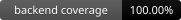

# Sales Analytics Platform

[](https://github.com/thomas-soares/sales-analytics/actions/workflows/ci.yml)
[](https://github.com/thomas-soares/sales-analytics/actions/workflows/ci.yml)
[](https://github.com/thomas-soares/sales-analytics/actions/workflows/ci.yml)

Full stack sales analytics platform built with a FastAPI backend and a React 18 frontend. The app accepts a CSV upload, parses and validates sales rows, aggregates product/category totals, supports report filters, persists the latest report in the browser, and exports reports as CSV or JSON.

## Stack

- Backend: Python 3.11, FastAPI, stdlib `csv`, `dataclasses`, `Decimal`, pytest.
- Frontend: React 18, TypeScript strict, Vite, pnpm, PrimeReact, Vitest, jsdom.
- Runtime: Docker Compose for backend and frontend services.

## Project Structure

- `backend/parser.py`: CSV reading, required-field validation, quantity/price validation, `Decimal` conversion, logging, and standalone `argparse` execution.
- `backend/core.py`: typed dataclasses, date/category filtering, product totals, category totals, global total, and most-sold product logic.
- `backend/output.py`: report serialization with formatted decimal strings.
- `backend/app.py`: FastAPI app with `/upload`, `/report`, `/health`, logging, errors, and OpenAPI docs.
- `backend/tests/`: parser, core, output, and API tests.
- `frontend/src/components/UploadDialog.tsx`: CSV upload dialog using PrimeReact `Dialog` and a native file input.
- `frontend/src/components/FilterPanel.tsx`: start date, end date, and category filters.
- `frontend/src/components/ReportTable.tsx`: PrimeReact `DataTable` report tables, summary cards, and CSV/JSON export actions.
- `frontend/src/components/ErrorNotification.tsx`: PrimeReact `Toast` error notification.
- `frontend/src/hooks/useSalesApi.ts`: isolated upload/report hooks.
- `frontend/src/services/apiService.ts`: centralized backend HTTP calls and API base URL.
- `frontend/src/utils/`: formatting, report export, and localStorage persistence helpers.

## CSV Format

Upload a `.csv` file through the frontend `Upload CSV` area. The challenge statement shows a minimal CSV shape with product, quantity, and unit price fields. This implementation intentionally keeps an extended CSV contract so the required category totals and date/category filters can be computed from the uploaded data.

Required columns:

```csv
product,category,quantity,unit_price,date
Camiseta,Vestuario,3,49.90,2024-01-10
Calca,Vestuario,2,99.90,2024-01-11
Camiseta,Vestuario,1,49.90,2024-01-12
Tenis,Calcados,1,199.90,2024-01-13
```

The frontend reads the selected file with the browser `FileReader` API and validates headers plus each data row with simple `split` parsing before uploading. The backend remains responsible for the authoritative CSV parsing, validation, and aggregation using Python's standard `csv` module.

## API

- `GET /health`: returns API health status.
- `POST /upload`: accepts a CSV file as multipart form data and stores parsed rows in memory.
- `GET /report`: returns the aggregated report. Optional query params:
  - `start_date=YYYY-MM-DD`
  - `end_date=YYYY-MM-DD`
  - `category=<category>`

FastAPI Swagger/OpenAPI docs are available at `http://localhost:8000/docs` when the backend is running, including example responses and query parameter examples.

## Local Development

Backend:

```bash
cd backend
python -m venv .venv
source .venv/Scripts/activate
pip install -e .[dev]
uvicorn app:app --host 0.0.0.0 --port 8000 --reload
```

Frontend:

```bash
cd frontend
pnpm install --frozen-lockfile
pnpm dev
```

The frontend defaults to `http://localhost:8000` for the API. Override it with `VITE_API_BASE_URL` if needed.

## Docker

Run the application:

```bash
docker compose up --build
```

- Backend: `http://localhost:8000`
- Frontend: `http://localhost:5173`

The frontend service mounts the source directory at `/app` for live development and keeps `/app/node_modules` in a named Docker volume. This prevents Linux container dependencies from overwriting the local Windows `node_modules` directory while still allowing code changes to reload inside the container.

Stop the containers:

```bash
docker compose down
```

Run frontend tests with coverage in the container:

```bash
docker compose run --rm --no-deps frontend sh -c "pnpm install --frozen-lockfile && pnpm exec vitest --run --coverage"
```

## Tests

Backend:

```bash
cd backend
pytest
```

Frontend:

```bash
cd frontend
pnpm install --frozen-lockfile
pnpm exec vitest --run
pnpm exec vitest --run --coverage
pnpm build
```

## Coverage

The coverage badges at the top of this README are updated by GitHub Actions after the test suites run on `main`.

Coverage reports are generated at:

- Backend HTML report: `backend/htmlcov/index.html`
- Frontend HTML report: `frontend/coverage/index.html`

GitHub Actions also uploads both coverage folders as workflow artifacts after each CI run.

## Additional Features

- Browser persistence: the latest fetched report is saved to `localStorage`; the empty state offers explicit actions to restore or clear the saved report.
- Export: reports can be downloaded as `sales-report.csv` or `sales-report.json`.
- Docker Compose: backend and frontend services are defined in `docker-compose.yml`.
